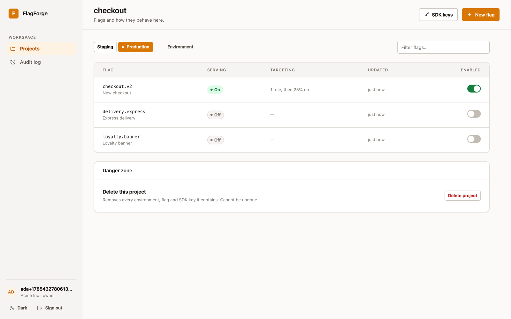
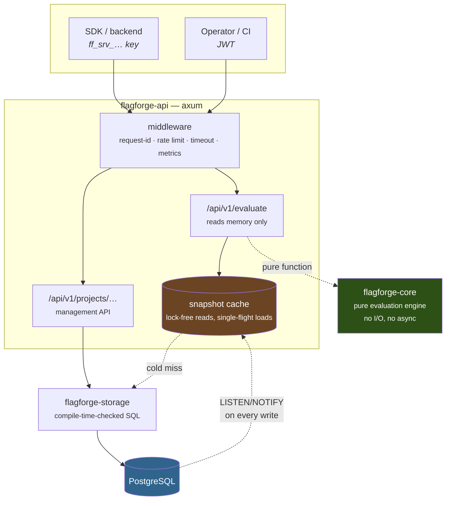
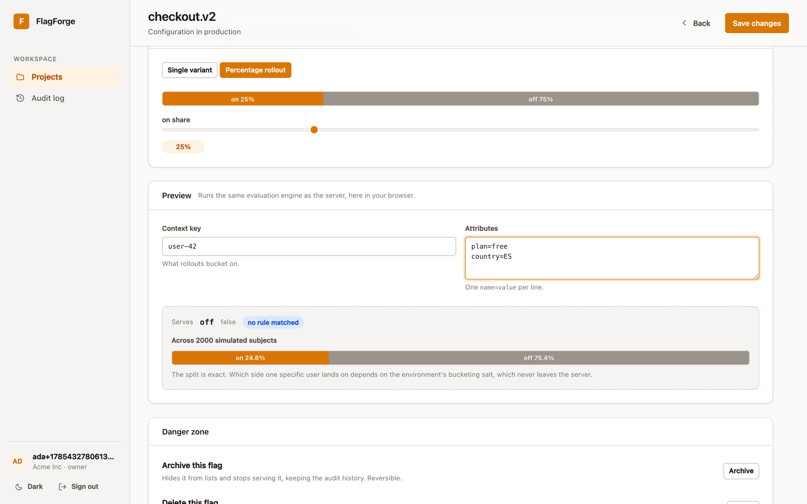
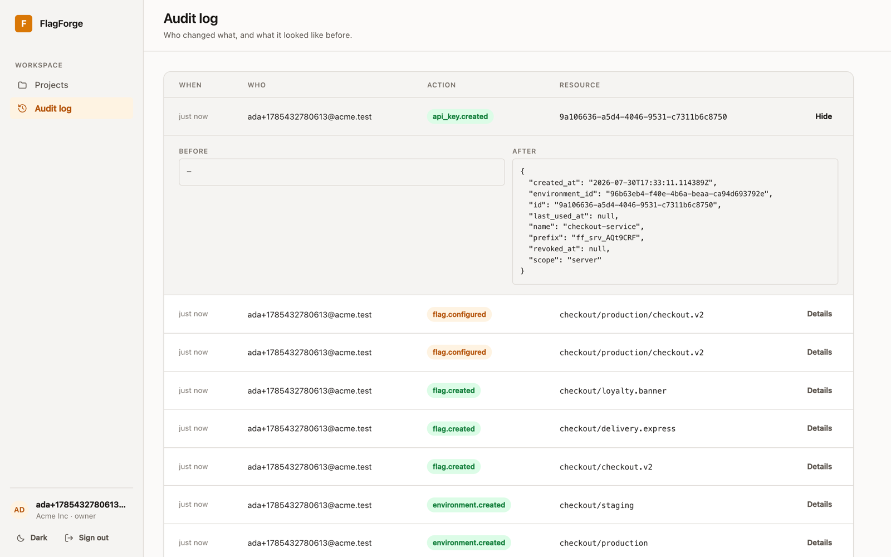
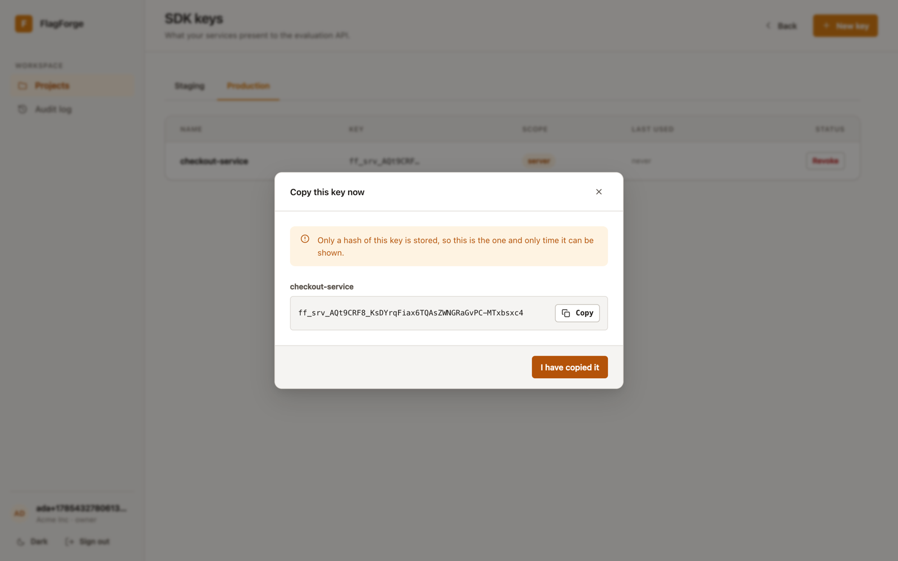
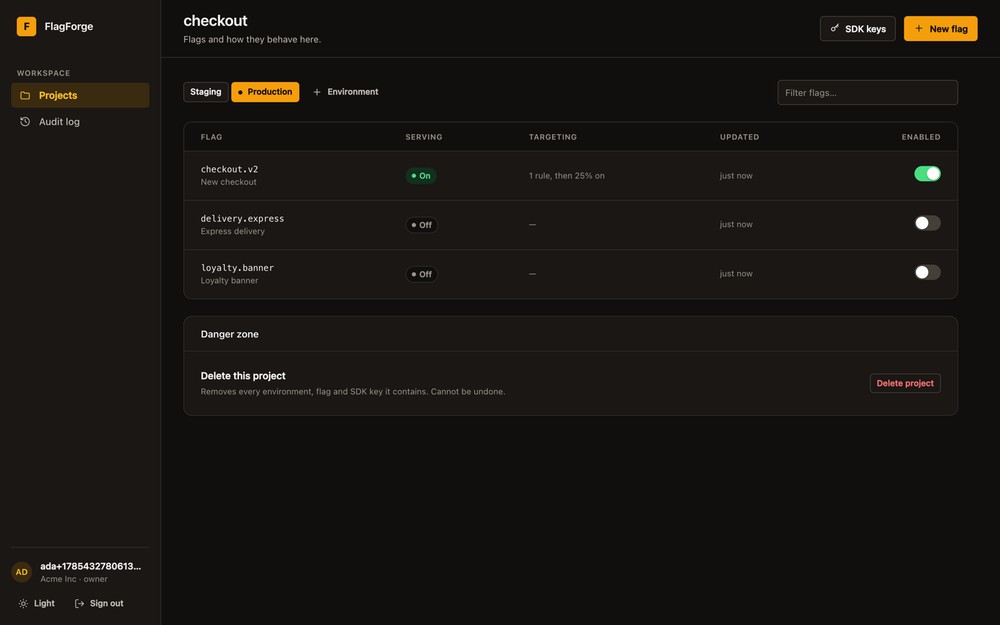

# FlagForge

**A multi-tenant feature-flag service in Rust.** Targeted rollouts, deterministic
bucketing, and an audit trail — with evaluation served from memory in
microseconds, and a dashboard compiled to WebAssembly from the same codebase.

[](https://github.com/your-user/flagforge/actions/workflows/ci.yml)
[](LICENSE)




*One binary: API, migrations and dashboard. No Node anywhere in the build.*

---

## What it does

A feature flag answers one question — *should this user get this feature?* —
and it has to answer it the same way every time, on every server, in
microseconds, while an operator changes the answer from a dashboard.

FlagForge is the service behind that question:

- **Targeting rules.** `plan in [pro, enterprise] AND seats >= 10` — seventeen
  operators including regex, semver and set membership.
- **Percentage rollouts.** Deterministic and sticky: `user-42` lands in the
  same bucket on every node, forever, without any shared state.
- **Per-environment configuration.** One flag, on in staging, at 5 % in
  production. Each environment has its own bucketing salt, so a canary in
  staging does not preselect the same users in production.
- **Multi-tenancy.** Organizations → projects → environments, isolated at the
  query level rather than by convention.
- **Two credential types.** Short-lived JWTs for humans, long-lived scoped keys
  for SDKs. Neither is accepted where the other belongs.
- **An audit trail.** Every change, with before/after and who made it.
- **A dashboard**, written in Rust with Leptos and compiled to WebAssembly —
  and embedded in the API binary, so the whole product is still one container.

---

## Architecture



Three crates, with the dependency arrow pointing one way:

| Crate | Responsibility | Why it is separate |
| --- | --- | --- |
| **`flagforge-core`** | Domain model + evaluation engine | No async runtime, no database, no HTTP. Evaluation is a pure function of `(flag, context, salt)`, so the part that has to be *correct* can be tested exhaustively — including property tests over the hash distribution. |
| **`flagforge-storage`** | PostgreSQL persistence | Every query is verified against the real schema at compile time by `sqlx`. A column rename breaks the build, not production. |
| **`flagforge-api`** | HTTP, auth, caching, OpenAPI | Exposed as a library too, so integration tests drive the *real* router over a *real* database. |
| **`flagforge-web`** | The dashboard, Leptos → WASM | Reuses `flagforge-core`, so the rule editor validates and previews with the engine the server runs. Its own workspace, because it only ever targets `wasm32`. |

---

## Quick start

```bash
git clone https://github.com/your-user/flagforge && cd flagforge
docker compose up --build
```

That brings up Postgres and the API on `http://localhost:8080`, applying
migrations on boot.

- **Dashboard**: http://localhost:8080/
- **Interactive API docs**: http://localhost:8080/docs

<details>
<summary>Running it natively instead</summary>

```bash
cp .env.example .env                       # then set DATABASE_URL and JWT_SECRET
docker run -d -p 5432:5432 \
  -e POSTGRES_USER=flagforge -e POSTGRES_PASSWORD=flagforge -e POSTGRES_DB=flagforge \
  postgres:18-alpine

cargo install sqlx-cli --no-default-features --features rustls,postgres
sqlx migrate run --source migrations
cargo run --bin flagforge
```
</details>

---

## A five-minute tour

```bash
BASE=http://localhost:8080

# 1. Register — creates an organization and returns an owner token.
TOKEN=$(curl -s -X POST $BASE/api/v1/auth/register -H 'content-type: application/json' \
  -d '{"organization_name":"Acme Inc","email":"ada@acme.test","password":"correct-horse-battery-staple"}' \
  | jq -r .token)
AUTH="authorization: Bearer $TOKEN"

# 2. A project, an environment, and a flag.
curl -s -X POST $BASE/api/v1/projects -H "$AUTH" -H 'content-type: application/json' \
  -d '{"key":"checkout","name":"Checkout"}'

curl -s -X POST $BASE/api/v1/projects/checkout/environments -H "$AUTH" -H 'content-type: application/json' \
  -d '{"key":"production","name":"Production","is_production":true}'

curl -s -X POST $BASE/api/v1/projects/checkout/flags -H "$AUTH" -H 'content-type: application/json' \
  -d '{"key":"checkout.v2","name":"New checkout"}'

# 3. An SDK key. The secret is shown exactly once.
SDK=$(curl -s -X POST $BASE/api/v1/projects/checkout/environments/production/keys \
  -H "$AUTH" -H 'content-type: application/json' \
  -d '{"name":"backend","scope":"server"}' | jq -r .secret)
```

Now the interesting part — **ship to paying customers immediately, and to 20 %
of everyone else**:

```bash
curl -s -X PUT $BASE/api/v1/projects/checkout/environments/production/flags/checkout.v2 \
  -H "$AUTH" -H 'content-type: application/json' -d '{
  "enabled": true,
  "off_variant": "off",
  "fallthrough": {
    "kind": "rollout",
    "weights": [{"variant": "on", "weight": 20000}, {"variant": "off", "weight": 80000}]
  },
  "rules": [{
    "id": "11111111-1111-1111-1111-111111111111",
    "description": "Paid plans get it immediately",
    "conditions": [{"attribute": "plan", "operator": "in", "values": ["pro", "enterprise"]}],
    "distribution": {"kind": "fixed", "variant": "on"}
  }]
}'
```

Evaluate as an SDK would:

```bash
curl -s -X POST $BASE/api/v1/evaluate/checkout.v2 \
  -H "authorization: Bearer $SDK" -H 'content-type: application/json' \
  -d '{"context":{"key":"user-42","attributes":{"plan":"pro"}}}'
```

```json
{
  "flag_key": "checkout.v2",
  "variant": "on",
  "value": true,
  "reason": { "kind": "target_match", "rule_id": "1111…", "index": 0 },
  "version": 2
}
```

The `reason` is the point. When someone asks *"why did this user see the new
checkout?"*, the answer is in the response — not in a debugging session.

---

## The dashboard

Written in Rust with [Leptos](https://leptos.dev), compiled to WebAssembly, and
embedded in the API binary with `rust-embed`. There is no Node in the build and
no second thing to deploy — the server that answers `/api/v1/evaluate` also
serves the page you configure it from, which means the API and its UI can never
be different versions.

### The rule editor runs the real evaluation engine



Because `flagforge-core` has no I/O and no async, the *same crate* compiles to
WASM. The editor is not approximating what the server would do — it is calling
`flagforge_core::evaluate` and `flagforge_core::validate` directly:

- **Validation is the server's validation.** A rollout that does not sum to
  100 % is caught as you type, with the same message and the same field path
  the API would have returned. The Save button stays disabled.
- **The preview is the engine.** Type a context and see which rule matched and
  why — no round trip, no drift between "what the UI thinks" and "what
  production does".
- **The simulation is exact.** It evaluates 2 000 synthetic subjects to show
  the real split. Aggregate distribution does not depend on the bucketing salt,
  so those percentages are what production will do. Which side one *specific*
  user lands on does depend on the salt, and the salt never leaves the server —
  so the UI says that rather than pretending otherwise.

### The rest of it

| | |
| --- | --- |
|  | **Audit log** with a before/after diff on every change. |
|  | **SDK keys**, with the secret shown exactly once — only its hash is stored. |
|  | **Light and dark**, chosen from the OS and then remembered. Set before first paint, so there is no flash. |

Details that took the most care:

- **Optimistic toggles.** Flipping a flag moves the switch immediately and
  rolls back if the write is rejected. Every write carries the version it read,
  so losing a race to another operator produces "someone else changed this
  flag" and a reload — never a silent overwrite.
- **Loading, empty and failed are three different screens.** Fetches are
  modelled as `Load::{Loading, Ready, Failed}` rather than as an absent value,
  so a slow request shows skeletons, an empty project explains what to do next,
  and a failure offers a retry.
- **Deep links work.** `/projects/checkout/flags/checkout.v2` survives a reload:
  unknown paths return the SPA shell, while anything under `/api/` stays a
  problem document instead of becoming a page of HTML.
- **Keyboard and screen readers.** The switch is a real `role="switch"`, modals
  close on Escape and on a backdrop click, and every control's accessible name
  contains its visible text (WCAG 2.5.3).

### Working on it

```bash
cargo run --bin flagforge                      # API on :8080
cd crates/web && trunk serve                   # dashboard on :8081, API proxied
```

`crates/web` is a separate workspace targeting `wasm32-unknown-unknown` only,
so `cargo build` at the repository root stays a native build and never drags a
WASM toolchain into it. `trunk build --release` writes `crates/web/dist`, which
the server build embeds; without it the binary still runs and simply reports
that no dashboard is bundled.

---

## Design decisions

The choices below are the ones that shaped the code. Each solves a problem that
shows up in production rather than in a tutorial.

### Evaluation never touches the database

An SDK may evaluate flags on every request its own service handles. A database
round trip per evaluation would make FlagForge the slowest thing in the
caller's stack.

Instead each node holds an immutable `EnvironmentSnapshot` in memory. Reads are
lock-free (`ArcSwap`), so a reader never contends with a concurrent reload;
cold loads are single-flighted behind a mutex, so a hundred simultaneous
requests for an uncached environment issue *one* query rather than a hundred.

**A Postgres outage degrades to "flags are stale", not "flags are down."** A
failed refresh keeps serving the previous snapshot and logs a warning, because
flags that suddenly stop resolving are far worse than flags that are a minute
old.

### Postgres tells the nodes when to reload

Cache invalidation happens through `LISTEN/NOTIFY`: triggers on `flag_configs`
and `flags` emit a notification on every write, and each node holds one
`LISTEN` connection. No node-to-node messaging, no message broker.

Because it lives in the database rather than the application, a change made by
*anything* invalidates every node's cache — including a migration or a human in
`psql`:

```console
$ psql -c "UPDATE flag_configs SET enabled = false WHERE …"
UPDATE 1

$ curl … /api/v1/evaluate/checkout.v2
{"value": false, "reason": {"kind": "off"}, "version": 3}   # ← no API call involved
```

A periodic sweep runs alongside it, because the two mechanisms fail
differently: `LISTEN` is sub-second but dies silently when a connection drops;
the sweep is slow but cannot get stuck.

### Bucketing is a pure function, salted per environment

```rust
bucket(salt, flag_key, subject) -> [0, 100_000)
```

SHA-256 over the length-prefixed triple, taking the first 8 bytes mod 100 000.
Consequences:

- **Deterministic.** No shared state, no coordination, no sticky sessions. Two
  nodes that have never spoken agree on every user.
- **Uniform.** A property test asserts each decile lands within 5 % of expected
  across 40 000 subjects — a "10 % rollout" that actually hits 3 % is a silent
  incident.
- **Independent per environment.** Salt is per environment, so validating a
  rollout in staging does not preselect the same people in production.
- **Length-prefixed.** `("ab", "c")` and `("a", "bc")` must not collide.

Weights are in hundredths of a percent (100 000 total), so an operator can ship
to 0.001 % of traffic — at scale, "1 %" is still thousands of requests.

Rollouts can also bucket on an attribute instead of the context key
(`bucket_by: "account_id"`), which keeps every user of one account on the same
side of a rollout. Half a team seeing a new UI is its own kind of bug.

### An invalid flag can never reach the database

`flagforge-core::validate` rejects anything the engine could not evaluate
deterministically: weights that do not sum to the total, references to
non-existent variants, regexes that do not compile, operators without values.
Errors come back as RFC 9457 problem documents with JSON-pointer-ish paths:

```json
{
  "type": "validation_failed",
  "status": 422,
  "errors": [{ "path": "fallthrough.weights", "message": "weights must sum to 100000 (got 5)" }]
}
```

Editing a flag's variants re-validates *every* environment first, so you cannot
delete a variant that production is still serving. The error names the
environment that blocks you.

The engine still degrades gracefully rather than panicking — but if
`Reason::Error` ever appears outside a test, something upstream is broken.

### Two operators cannot silently overwrite each other

Flag configuration writes carry an optional `expected_version`. The write is a
single `INSERT … ON CONFLICT … WHERE flag_configs.version = $expected`, so the
race is resolved by Postgres rather than by a read-then-write in application
code that two replicas could interleave. The loser gets a 409 that says what
happened:

```json
{ "type": "conflict", "title": "flag configuration was modified by someone else (you were working from version 4)" }
```

Versions are bumped by a trigger, so a caller cannot set one itself.

### Credentials are separated by construction

| | Management API | Evaluation API |
| --- | --- | --- |
| Credential | JWT, 12 h | SDK key, long-lived |
| Scope | An organization | One environment |
| Storage | — | SHA-256 of a 256-bit random secret |
| Presented to the other | `401` with an explanation | `401` with an explanation |

Two separate extractors, so an SDK key can never be accepted where a user token
is expected even by mistake. SDK keys are hashed with SHA-256 rather than
Argon2 on purpose: there is no low-entropy guess to slow down, and the
evaluation endpoint verifies one on *every* request. Passwords, which do have
guessable inputs, use Argon2id.

Client-scoped keys can evaluate but cannot download `/api/v1/snapshot` —
targeting rules name internal segments ("employees", "beta customers"), and
that is not something to ship to a browser. The bucketing salt is excluded from
every response; a test asserts it never appears, including in the OpenAPI
document.

### Login does not leak which accounts exist

An unknown email still costs a full Argon2 verification against a decoy hash,
and both failure modes return byte-identical responses. The decoy is computed
at first use rather than hard-coded, so it cannot drift out of sync with the
parameters real hashes use — a decoy that failed to parse would return
instantly and silently undo the whole thing.

### Errors say what happened; 500s say nothing

Every error is `application/problem+json` with a stable `type` slug clients can
branch on. Internal errors are logged in full and reported as a bare 500,
because the cause frequently contains a connection string:

```rust
#[tokio::test]
async fn internal_errors_never_leak_their_cause() {
    let secret = "postgres://user:hunter2@db/flagforge";
    let (status, _, body) = body_of(ApiError::Internal(anyhow!("connect failed: {secret}"))).await;
    assert!(!body.to_string().contains("hunter2"));
}
```

---

## Testing

```bash
cargo test --workspace        # needs DATABASE_URL for the integration suite
```

**137 tests**, in three layers:

- **Domain (49).** Pure unit tests plus `proptest` properties: buckets stay in
  range, bucketing is referentially transparent, field boundaries are
  unambiguous, and any full weight partition resolves.
- **HTTP unit (56).** Error mapping, token round trips, tampering detection,
  the rate limiter's refill maths, key generation, and OpenAPI generation
  (including a check that the domain and storage `Flag` types do not collide
  into one schema — utoipa keys schemas by type name).
- **Integration (32).** `#[sqlx::test]` gives each test its own freshly
  migrated database, and the suite drives the *real* router — middleware,
  extractors and all — via `tower::ServiceExt::oneshot`.

The integration tests assert the things that would actually hurt:

```rust
one_organization_cannot_see_or_touch_another
an_sdk_key_only_reaches_its_own_environment
the_snapshot_never_carries_the_bucketing_salt
a_stale_write_loses_to_the_one_that_got_there_first
removing_a_variant_an_environment_still_serves_is_refused
login_does_not_reveal_whether_an_account_exists
a_percentage_rollout_is_sticky_and_lands_near_its_target
a_revoked_sdk_key_stops_working_immediately
```

CI runs `cargo fmt --check`, `clippy -D warnings`, the full suite against a
real Postgres, `cargo audit`, and builds the Docker image — then boots it
against a live database and waits for `/health/ready`.

It also runs `cargo sqlx prepare --check`, which catches the classic failure:
someone edits a query, forgets to regenerate the offline cache, CI passes, and
the Docker build (which has no database) breaks.

---

## Operations

| Endpoint | Purpose |
| --- | --- |
| `GET /health` | Liveness. Checks nothing else — a liveness probe that fails during a database outage just restarts every replica. |
| `GET /health/ready` | Readiness. Round-trips a query and reports cached environments. |
| `GET /metrics` | Prometheus: request rate and latency by *matched* route, evaluations by reason, cache hits/misses, login failures, rate limiting. |
| `GET /docs` | Swagger UI (non-production only). |
| `GET /openapi.json` | The generated document. `cargo run --example dump_openapi` produces the same thing without booting anything, for client codegen in CI. |

Metrics are labelled with the matched route (`/api/v1/projects/{project_key}`)
rather than the raw URI, so cardinality stays bounded no matter how many
projects exist. `flagforge_evaluations_total{reason="flag_not_found"}` is the
one to alert on: it means an SDK is asking for a flag nobody created.

The server drains on `SIGTERM` within a bounded grace period. Cutting live
evaluations mid-flight makes SDKs fall back to their hard-coded defaults, which
looks exactly like a flag being turned off.

### Deploying

The image is distroless and runs as non-root — no shell, no package manager,
nothing to pivot with. It applies its own migrations on boot (sqlx takes an
advisory lock, so concurrent replica starts serialize rather than race).

```bash
fly launch --no-deploy
fly postgres create --name flagforge-db
fly postgres attach flagforge-db                      # sets DATABASE_URL
fly secrets set JWT_SECRET="$(openssl rand -base64 48)"
fly deploy
```

Configuration is entirely environment variables (see [`.env.example`](.env.example));
the server validates all of them at startup and reports *every* problem at
once, so a misconfigured deploy needs one restart rather than five. A
`JWT_SECRET` shorter than 32 characters is a refusal to boot, not a warning.

---

## Project layout

```
flagforge/
├── crates/
│   ├── core/          # domain model + evaluation engine (no I/O)
│   │   ├── bucket.rs      # deterministic hashing, + property tests
│   │   ├── engine.rs      # evaluate(flag, context, salt)
│   │   ├── matcher.rs     # targeting operators
│   │   └── validate.rs    # what may never reach the database
│   ├── storage/       # sqlx repositories, compile-time-checked SQL
│   ├── api/           # axum handlers, auth, cache, OpenAPI
│   │   └── tests/         # integration suite over a real Postgres
│   └── web/           # Leptos dashboard -> WASM, own workspace
│       ├── src/pages/     # login, projects, flags, keys, audit
│       └── styles/        # handwritten design system, light + dark
├── migrations/        # schema + NOTIFY triggers
├── .sqlx/             # offline query cache, so CI and Docker need no database
└── .github/workflows/ # fmt · clippy · test · audit · docker
```

---

## License

MIT — see [LICENSE](LICENSE).
